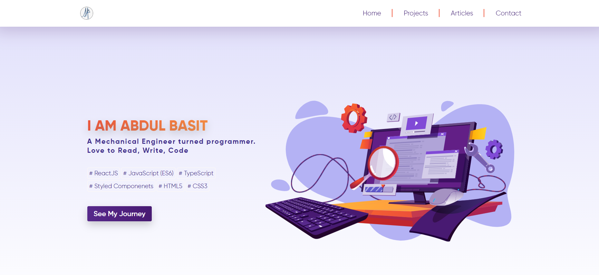
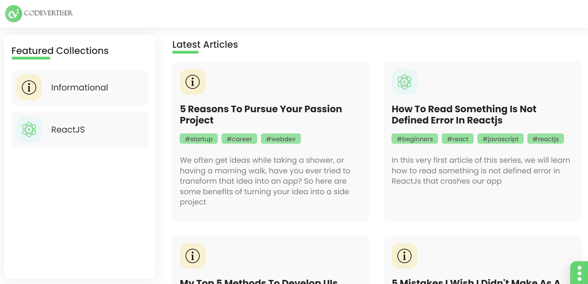
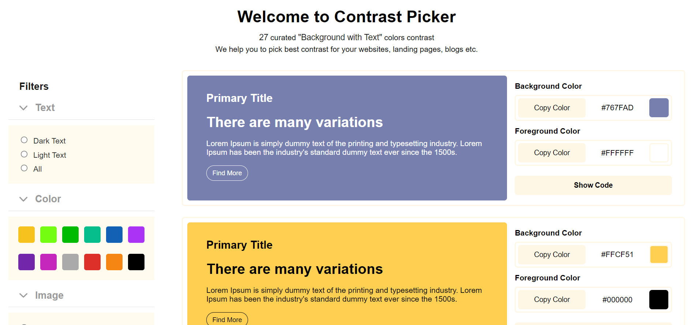
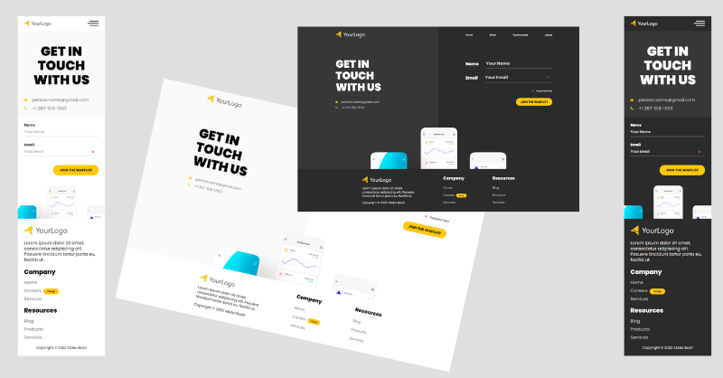

I am a Frontend Reactjs Developer with 2 years of working experience.

I love to share my learnings on DevCommunity where my posts have crossed 384,000+ views, and one of my articles has been featured in the Top 7 articles of the week.

My Dev.to profile: https://dev.to/abdulbasit313

### Portfolio

I have rebuilt my portfolio here you can check it out.

<strong>[Visit](codewithbasit.netlify.app)</strong>

 

### My Articles | Codevertiser.com

I have launched my Gatsby blogging site where you can read interactive programming-related articles via the power of MDX files.

<strong>[Visit](https://www.codevertiser.com/)</strong>

 

### Passion Projects

<strong>Color Contrast Collections</strong>
<em>59 curated "Background with Text" colors contrast</em>

These days I am working on my passion project Color Contrast Collections. This web app helps you to pick the best contrast for our landing, blogs, etc.

<strong>[Visit](https://color-contrast-collection.netlify.app/)</strong>

 

<strong>Reactjs Template</strong>

Free Reactjs Waitlist Template with Light and Dark Theme

<strong>[Demo](https://waitlist-templates.web.app/)</strong>

### Contact Me!

[Twitter](https://twitter.com/Basit_Miyanji)
[Linkedin](https://www.linkedin.com/in/abdulbasitprofile/)
